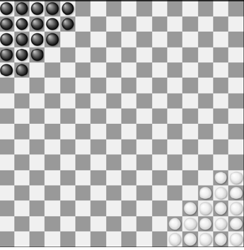
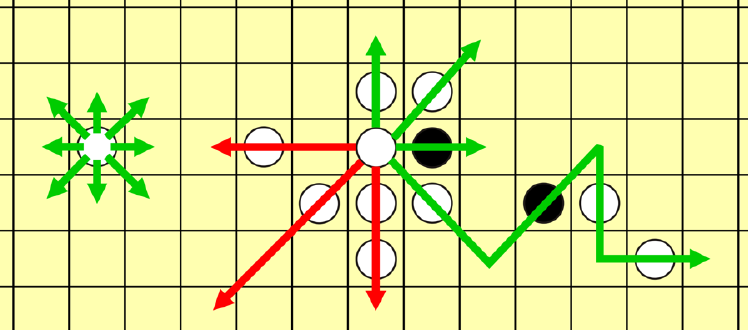

Setup for two players:
Note: we only consider the two-player variant here; this game can also be played by four players
but we will not explore this here.
- Simple wooden pawn-style playing pieces, often called "Halma pawns."
- The board consists of a grid of 16×16 squares.
- Each player's camp consists of a cluster of adjacent squares in one corner of the board.
These camps are delineated on the board.
- For two-player games, each player's camp is a cluster of 19 squares. The camps are in
opposite corners.
- Each player has a set of pieces in a distinct color, of the same number as squares in each
camp.
- The game starts with each player's camp filled by pieces of their own color.
The initial setup is shown below for black and white players. We will always use this exact initial
setup in this homework.

Play sequence:
We first describe the typical play for humans. We will then describe some minor modifications
for how we will play this game with artificial agents.
- Create the initial board setup according to the above description.
- Players randomly determine who will move first.
- Pieces can move in eight possible directions (orthogonally and diagonally).
- Each player's turn consists of moving a single piece of one's own color in one of the
following plays:
o One move to an empty square:
§ Move the piece to an empty square that is adjacent to the piece’s original
position (with 8-adjacency).
§ This move ends the play for this player’s turn.
o One or more jumps over adjacent pieces:
§ An adjacent piece of any color can be jumped if there is an empty square
on the directly opposite side of that piece.
§ Place the piece in the empty square on the opposite side of the jumped
piece.
§ The piece that was jumped over is unaffected and remains on the board.
§ After any jump, one may make further jumps using the same piece, or end
the play for this turn.
§ In a sequence of jumps, a piece may jump several times over the same
other piece.
- Once a piece has reached the opposing camp, a play cannot result in that piece leaving
the camp.
- If the current play results in having every square of the opposing camp that is not already
occupied by the opponent to be occupied by one's own pieces, the acting player wins.
Otherwise, play proceeds to the other player.
Below we show examples of valid moves (in green) and invalid moves (in red). At left, the isolated
white piece can move to any of its empty 8 neighbors. At right, the central white piece can jump
over one adjacent piece if there is an empty cell on the other side. After one jump is executed,
possibly several other valid jumps can follow with the same piece and be combined in one move;
this is shown in the sequence of jumps that start with a down-right jump for the central piece.
Note that additional valid moves exist that are not shown (e.g., the central white piece could
move to some adjacent empty location).
Note the invalid moves: red arrow going left: cannot jump over one or more empty spaces plus
one or more pieces. Red arrow going left-down: cannot jump over one or more pieces plus one
or more empty spaces. Red arrow going down: cannot jump over more than one piece.

Input: The file input.txt in the current directory of your program will be formatted as follows:
First line: A string SINGLE or GAME to let you know whether you are playing a single move
(and can use all of the available time for it) of playing a full game with potentially
many moves (in which case you should strategically decide how to best allocate
your time across moves).
Second line: A string BLACK or WHITE indicating which color you play. The colors will always be
organized on the board as follows:
(black starts in the top-left corner and white in the bottom-right).
Third line: A strictly positive floating point number indicating the amount of total play time
remaining for your agent.
Next 16 lines: Description of the game board, with 16 lines of 16 symbols each:
§ W for a grid cell occupied by a white piece
§ B for a grid cell occupied by a black piece
§ . (a dot) for an empty grid cell
